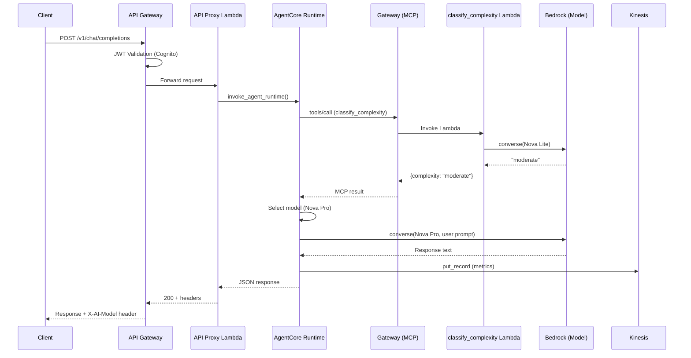
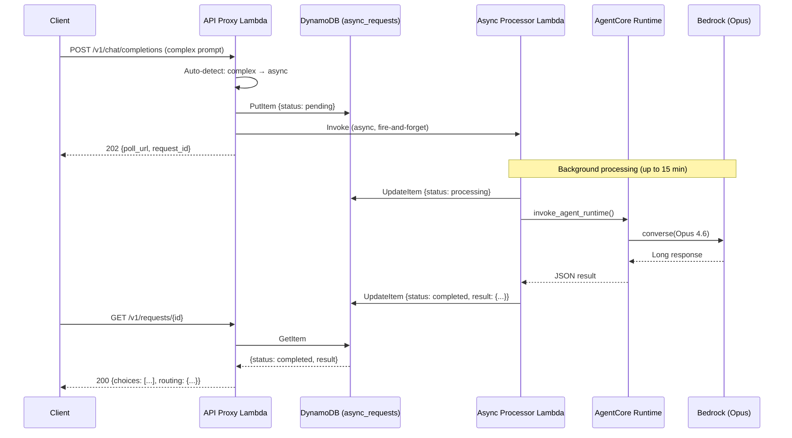
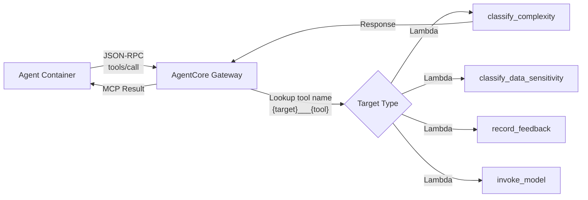
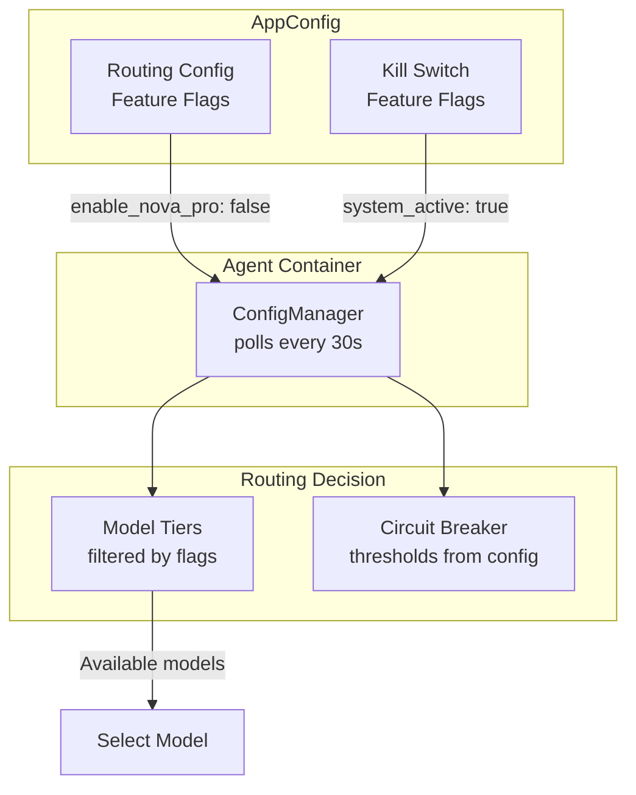
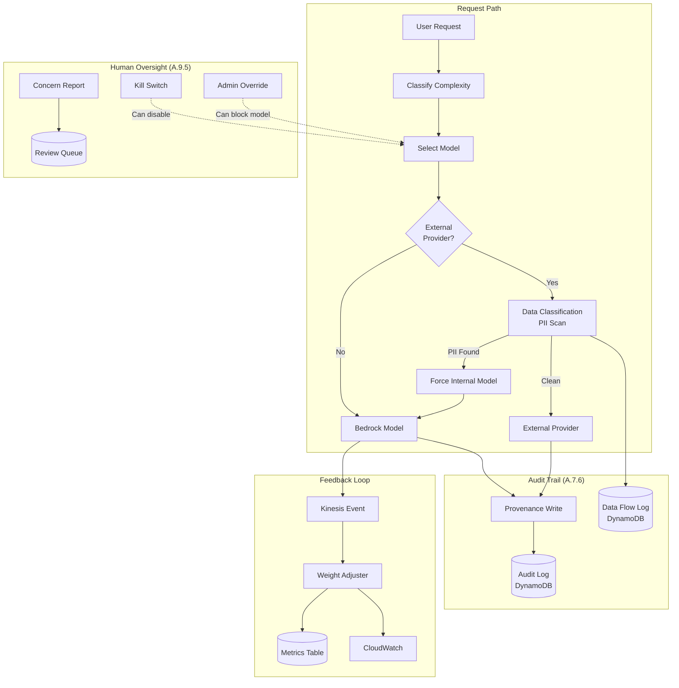
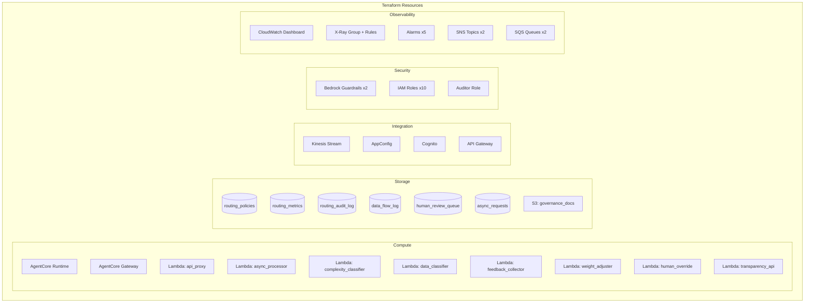

# Architecture Diagrams

These Mermaid diagrams render automatically on GitHub. For PNG exports with AWS icons, see `diagrams/generate.py`.

## Request Flow (Sync)

## Request Flow (Async - Complex)

## Gateway MCP Tool Flow

## AppConfig Hot-Swap

## Data Flow & Compliance

## Component Map

